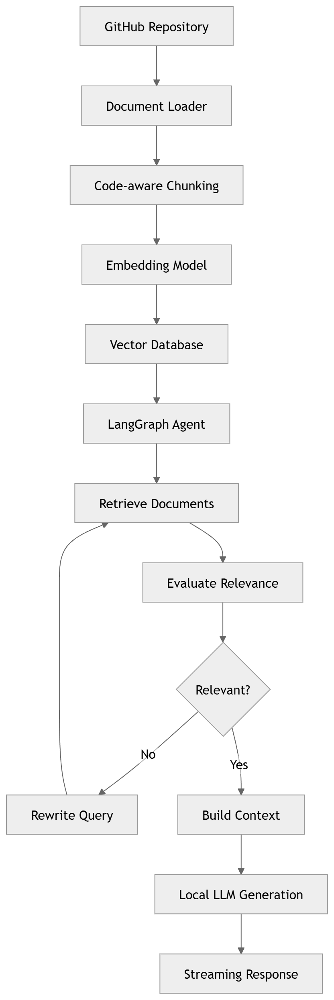
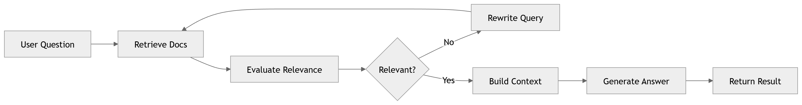
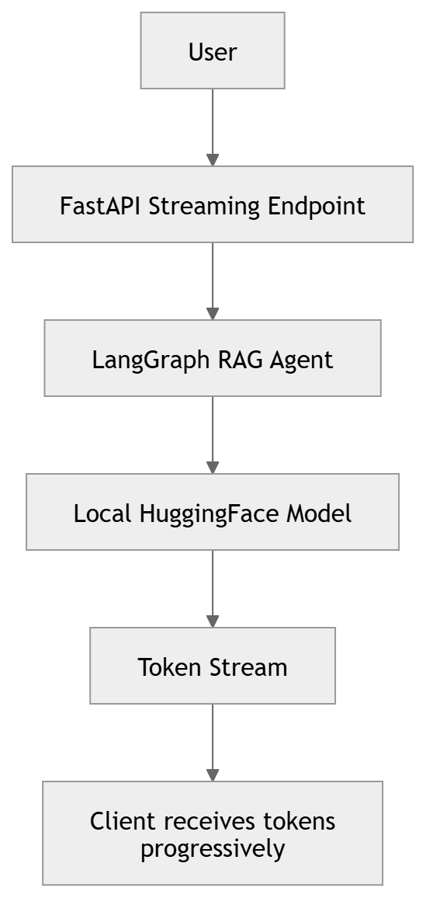

# AI Engineering Knowledge Assistant

An AI-powered codebase assistant that helps developers understand repositories using Retrieval-Augmented Generation (RAG) and a local LLM.

The system indexes a GitHub repository, builds semantic embeddings, and answers engineering questions using a LangGraph agent workflow. It supports streaming responses, adaptive retrieval, and runs entirely with local models.

## Architecture

The system combines:

- Semantic search
- Adaptive RAG
- LangGraph agent workflows
- Local LLM inference
- Streaming responses

### Diagrams
#### System Architecture

#### LangGraph Agent Workflow

#### Streaming Response Flow

### High-Level Flow

```
GitHub Repository
        │
        ▼
Document Loader
        │
        ▼
Code-aware Chunking
        │
        ▼
Embedding Model
        │
        ▼
Vector Database
        │
        ▼
LangGraph RAG Agent
        │
 ┌──────┼──────────┐
 │      │          │
Retrieve  Evaluate  Rewrite Query
Docs      Relevance  (if needed)
 │                     │
 └───────────────┬─────┘
                 ▼
           Build Context
                 │
                 ▼
         Local LLM Generation
                 │
                 ▼
        Streaming Response
```

## Features

### 1. Repository Ingestion
The system can ingest a GitHub repository and extract code files. Supported file types include:
- Python
- JavaScript
- TypeScript
- Markdown
- Other text-based documentation

### 2. Code-Aware Chunking
Instead of splitting text arbitrarily, the system splits code by logical units:
- classes
- functions
- modules

This improves retrieval accuracy.

### 3. Vector Search
Each chunk is converted into embeddings and stored in a vector database. Semantic search enables queries such as:
- How does authentication work?
- Where is JWT implemented?
- Which functions call Stripe API?

### 4. Adaptive RAG with LangGraph
The system uses a LangGraph agent workflow that can:
- retrieve documents
- evaluate retrieval relevance
- rewrite queries when results are poor
- generate answers with source references

### 5. Local LLM Support
The assistant runs entirely with local Hugging Face models. Example models:
- gpt2
- TinyLlama
- phi-2
- Mistral

This allows the system to run without external API dependencies.

### 6. Streaming Responses
Responses are streamed token-by-token to the client. This improves user experience by displaying answers as they are generated.

## Project Structure

```
ai-engineering-assistant
│
├── backend
│   │
│   ├── app
│   │   │
│   │   ├── agents
│   │   │   ├── rag_agent.py
│   │   │   └── streaming_rag_agent.py
│   │   │
│   │   ├── api
│   │   │   ├── chat.py
│   │   │   └── stream_chat.py
│   │   │
│   │   ├── ingestion
│   │   │   ├── github_loader.py
│   │   │   ├── code_chunker.py
│   │   │   └── index_repo.py
│   │   │
│   │   ├── retrieval
│   │   │   ├── vector_store.py
│   │   │   └── graph_retrieval.py
│   │   │
│   │   └── main.py
│   │
│   ├── requirements.txt
│   └── chroma_db
│
└── README.md
```

## Installation

1. **Clone Repository**
   ```bash
   git clone https://github.com/nilsoncaputti/llm-rag-langgraph.git
   cd llm-rag-langgraph
   ```
2. **Create Virtual Environment**
   ```bash
   python -m venv venv
   ```
   Activate it:
   - **Linux / Mac:**
     ```bash
     source venv/bin/activate
     ```
   - **Windows:**
     ```bash
     venv\Scripts\activate
     ```
3. **Install Dependencies**
   ```bash
   pip install -r requirements.txt
   ```

## Usage

### Index a Repository
Before using the assistant, you must index a repository.
```bash
python -m app.ingestion.index_repo
```
This step will:
- clone the repository
- extract code files
- create embeddings
- store vectors in the database

### Running the Server
Start the FastAPI server:
```bash
uvicorn app.main:app --reload
```
Open API docs: [http://127.0.0.1:8000/docs](http://127.0.0.1:8000/docs)

### API Usage

#### Standard RAG Endpoint
`POST /ask`

**Example request:**
```json
{
  "question": "Where is authentication implemented?"
}
```

**Example response:**
```json
{
  "answer": "... explanation ...",
  "sources": [
     "repo/auth/security.py"
  ]
}
```

#### Streaming Endpoint
`POST /stream`

This endpoint streams tokens progressively.

**Example request:**
```json
{
  "question": "How does authentication work?"
}
```

### Example Questions
You can ask the assistant questions such as:
- Where is authentication implemented?
- How does the login flow work?
- Which modules use JWT tokens?
- Which functions interact with the database?

## Future Improvements
Potential enhancements include:
- repository dependency graph understanding
- multi-language code parsing
- improved code-aware chunking
- React chat interface
- evaluation pipeline for RAG quality
- GPU-accelerated local LLM inference

## Tech Stack

- **Backend:** Python, FastAPI
- **AI:** LangGraph, LangChain, HuggingFace Transformers
- **Data:** Chroma Vector DB, Sentence Transformers
- **Infrastructure:** Local LLM inference, Streaming API responses

## License
[MIT License](LICENSE)

